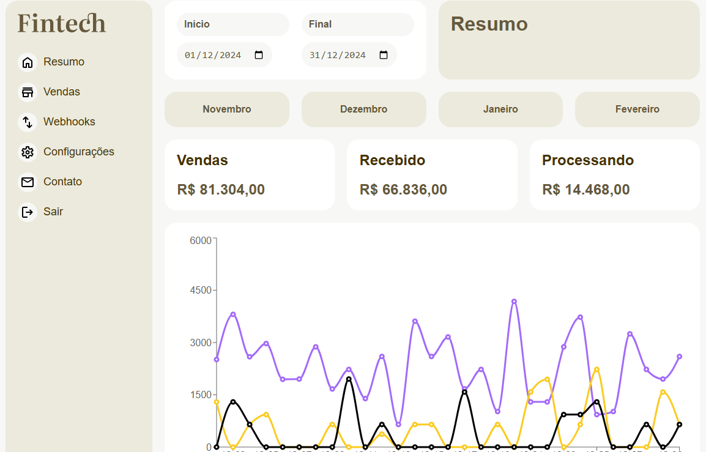

<h1 align="center">
  📈 Fintech
</h1>

  

<h4 align="center"><a href="https://fintech-six-indol.vercel.app/">Clique para visitar o projeto</a></h4>

## 📚 Sobre o projeto

Projeto final do curso de React com TypeScript, colocando em prática todo conhecimento abordado no curso. É um projeto de dashboard com informações de vendas, onde os dados vem de uma API junto com a utilização da biblioteca recharts para exibição de graficos dinâmicos. 🚀

## 🧑🏽‍💻 Funcionalidades | Interações

☑️ Visualizar um layout adequado ao seu dispositivo. 
☑️ Alternar entre páginas por meio do React Router.
☑️ Exibição dos dados de vendas pela data ou os ultimos quatro meses.

## 🛠️ Tecnologias utilizadas

- ReactJS
- React Router
- TypeScript
- Recharts